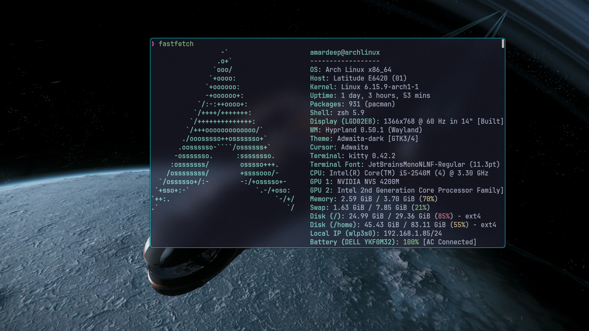
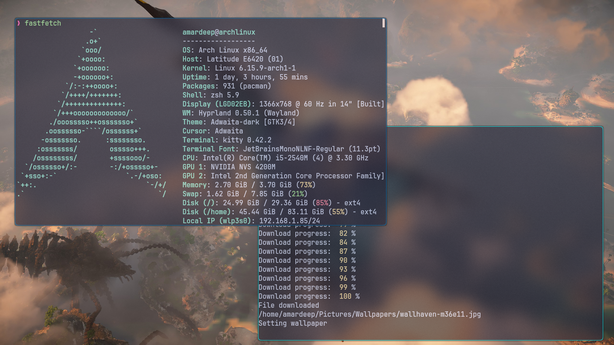

# rand_wallhaven

A simple command-line tool to download random wallpapers from [wallhaven.cc](https://wallhaven.cc/) and save it as wallpaper;

## Direction to use

1. Download the executable file from [Releases](https://github.com/amardeepXy/rand_wallhaven/releases/latest)
   > [!IMPORTANT]
   > Since this project is using swaybg to set the wallpaper, Install `swaybg`.
2. Install swaybg `yay -S swaybg`.
3. Run the executable file, Run `./wallhaven` to run the program.

## For manual build

1. Clone the repository `git clone https://github.com/amardeepXy/rand_wallhaven.git`.
2. Change working directory into the directory `cd rand_wallhaven`.
3. Install dependencies `npm install`.
4. Build using `npm run build`.
   This will create a directory `dist` in the current working directory.
5. Compile the build `npm run compile`.
   This generate a executable `wallhaven` in the current working directory.
6. Run the executable `./wallhaven`.

---
---

> [!TIP]
> Move the executable `wallhaven` file to `/usr/bin` or `/usr/local/bin` to make it available as a command.

## Contribution
   If you want to contribue to this project follow the standard github guidelines and push your changes with a new branch. 
