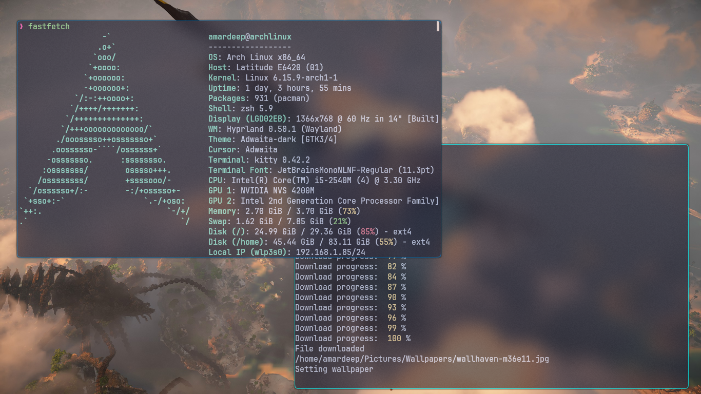
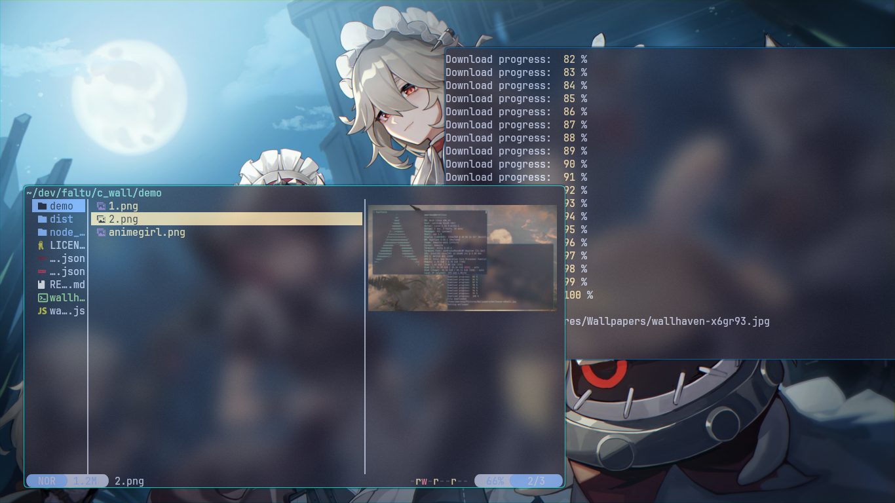

# rand_wallhaven

A simple command-line tool to set random wallpapers on wayland using swww.

## Direction to use

1. Download the executable file from [Releases](https://github.com/amardeepXy/rand_wallhaven/releases/latest)
   > [!IMPORTANT]
   > Since this project is using swaybg to set the wallpaper, Install `swww`.
2. Install swaybg `yay -S swww`(Use your package manager).
3. Run the executable file, Run `./wallhaven` to run the program.

## For manual build

1. Clone the repository `git clone https://github.com/amardeepXy/rand_wallhaven.git`.
2. Change working directory into the directory `cd rand_wallhaven`.
3. Install dependencies `npm install`.
4. Build using `npm run build`.
   This will create a directory `dist` in the current working directory.
5. Compile the build `npm run compile`.
   This generate a executable `wallhaven` in the current working directory.
6. Run the executable `./wallhaven`.

---

## Example usage

`rand_wallhaven --transition-type wipe --transition-step 50`

---

> [!TIP]
> Move the executable `wallhaven` file to `/usr/bin` or `/usr/local/bin` to make it available as a command.
> Alos don't forget to use at keybind 😽.

## Contribution

If you want to contribue to this project follow the standard github guidelines and push your changes with a new branch.

## New implementations (AIM)

1. [ ] Stateful History
       `rand_wallhaven prev
rand_wallhaven next`
2. [ ] Rank fetched images on the basis of favourites, views and set it.
3. [ ] Make the app configurable by config file.
4. [ ] Search functionality.
5. [ ] Allow to create profiles.
       `rand_wallhaven set --profile calm
rand_wallhaven set --profile aggressive`
